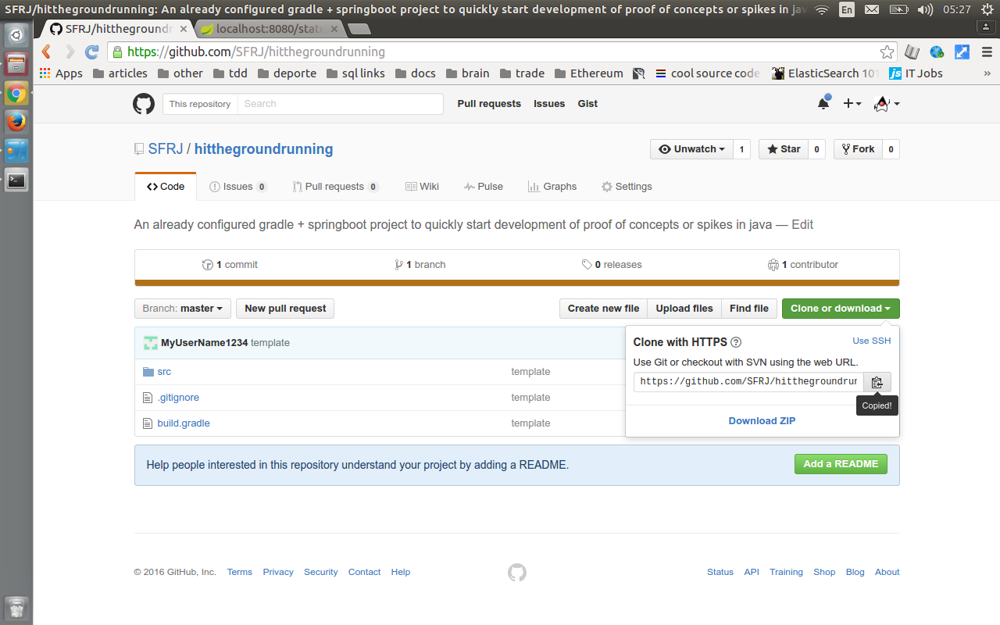

# hitthegroundrunning
This project is an already configured gradle + springboot project to quickly start development of proof of concepts or spikes in java. 

<b>Libraries included:</b>
<ul>
<li>spring mvc</li>
<li>spring boot</li>
<li>apache commons lang 3</li>
<li>slf4j</li>
<li>unirest</li>
<li>json-io</li>
<li>junit</li>
<li>mockito</li>
<li>assertj</li>
<li>jsonassert</li>
</ul>    

<b>How to use</b>

