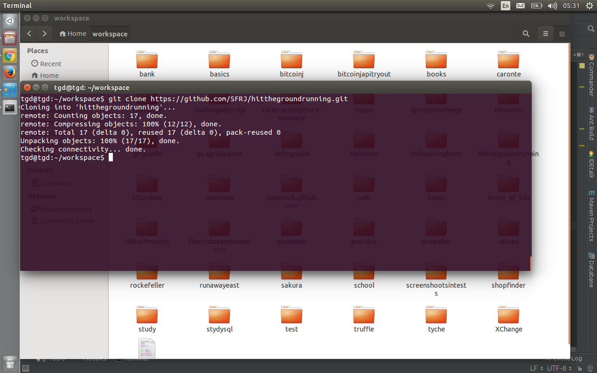

# hitthegroundrunning
This project is an already configured gradle + springboot project to quickly start development of proof of concepts or spikes in java. 

<b>Libraries included:</b>
<ul>
<li>spring mvc</li>
<li>spring boot</li>
<li>apache commons lang 3</li>
<li>slf4j</li>
<li>unirest</li>
<li>json-io</li>
<li>junit</li>
<li>mockito</li>
<li>assertj</li>
<li>jsonassert</li>
</ul>    

<h2><b>How to prepare this template for use</b><h2>
<h3>1- The first thing you need to do, is to copy this repos url<h3> 
  
<h3>2- Go to the terminal and clone it<h3> 
  
<h3>3- Rename the project<h3> 
  
<h3>4- Delete the docs folder(It just contains the images of this readme) <h3>  
<h3>5- Open project in IntelliJ<h3> 
  
<h3>6- Link intellij gradle project<h3> 
  
<h3>7- Use the local gradle distribution<h3> 
  
<h3>8- Set SDK<h3> 
  
<h3>9- Select Java<h3> 
  
<h3>10- Run smoke test<h3> 
  
<h3>11- Setup Spring faucet<h3> 
  
   
How to run from terminal during development
<ul>
<li> Navigate to the project<li>
<li> run <b>gradle wrapper<b>(only first time)<li>
<li> run <b>./gradlew clean build<b><li>
<li> run <b>./gradlew bootRun<b><li>
<ul>
